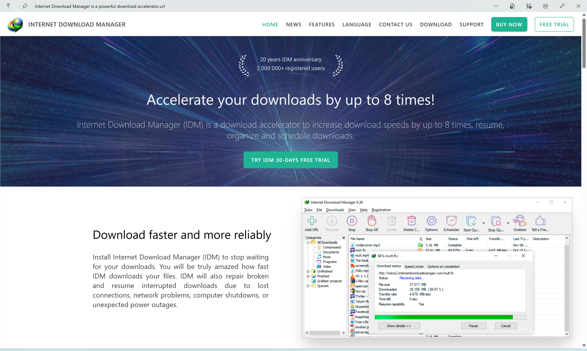
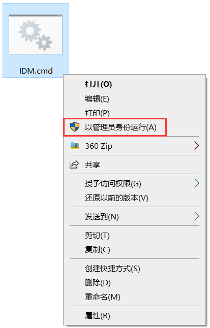
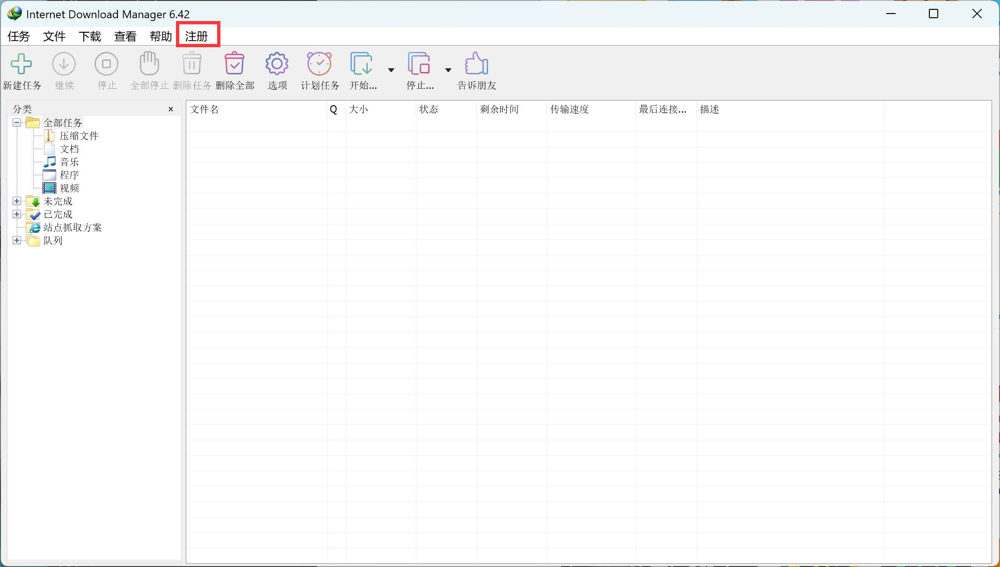
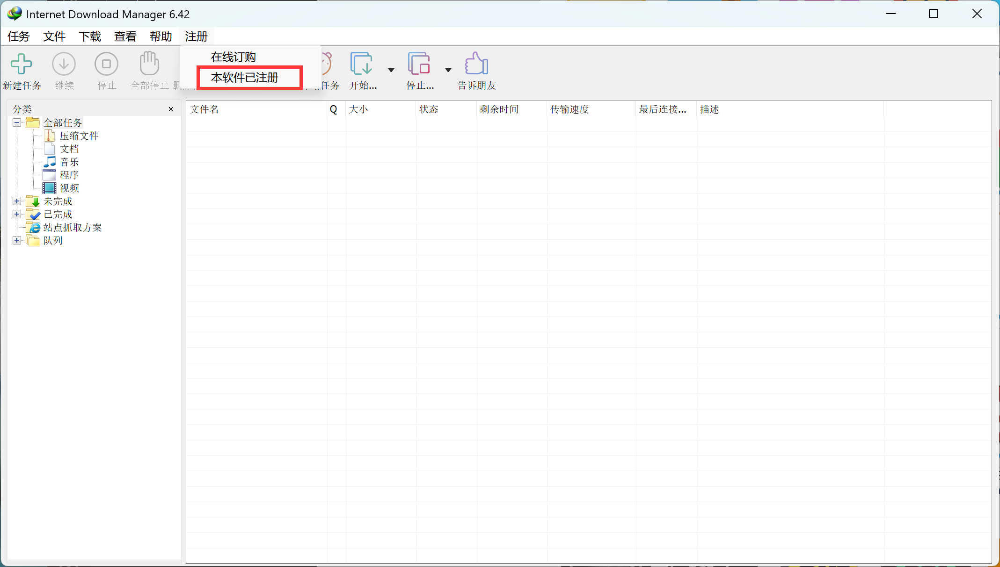
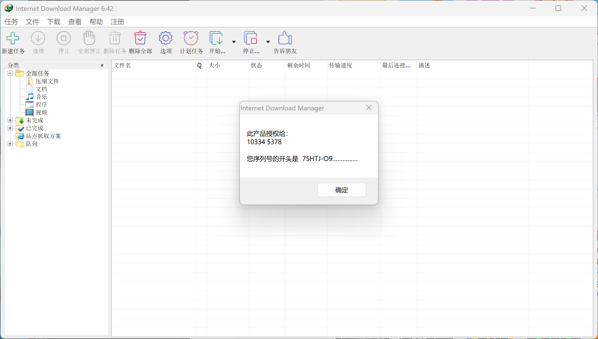
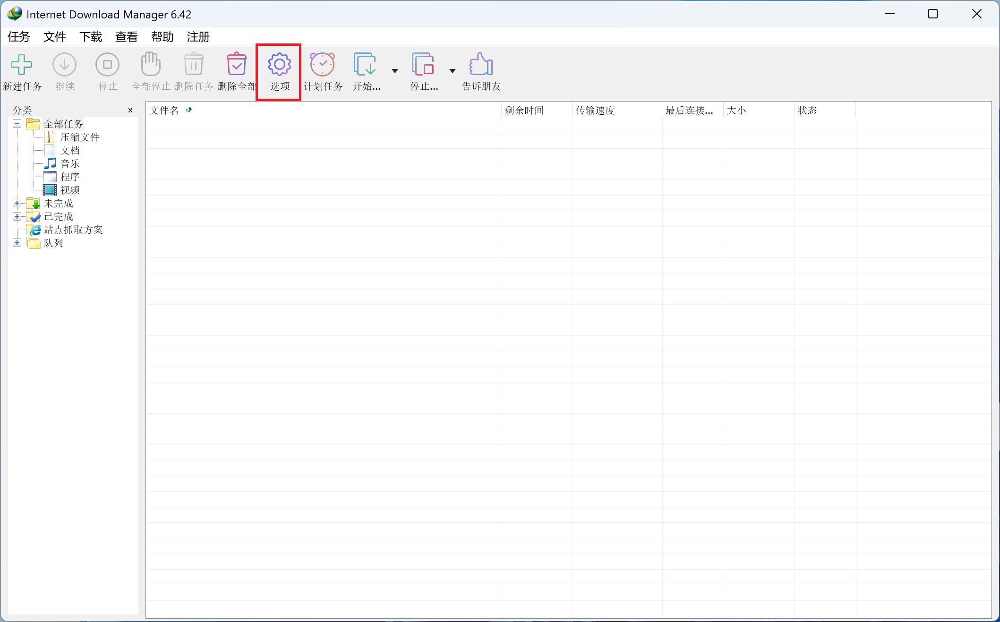
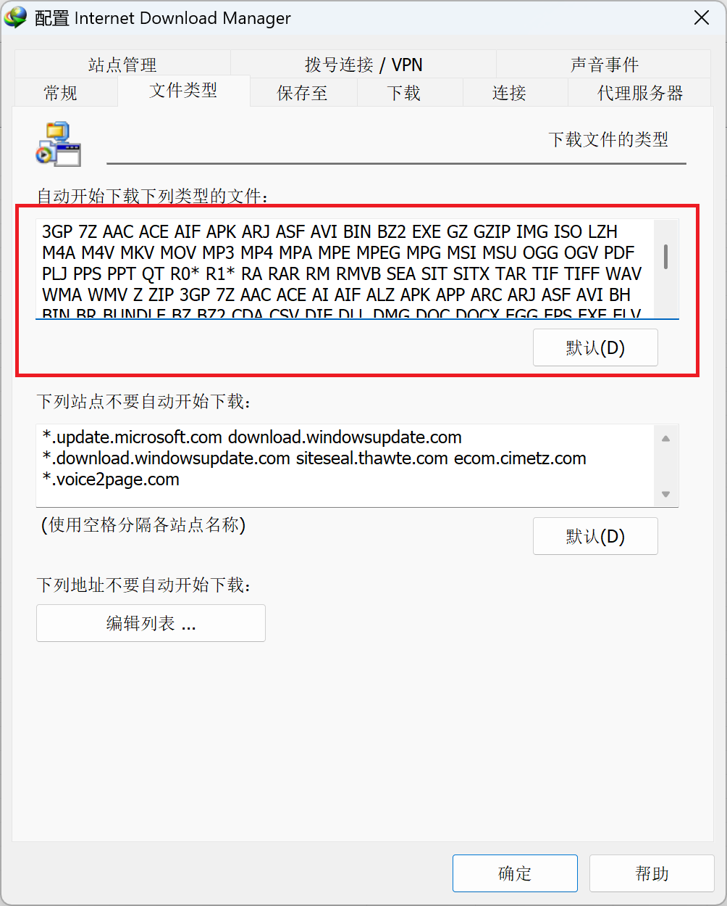
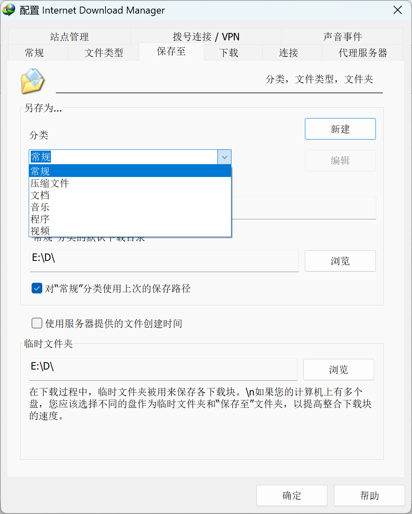
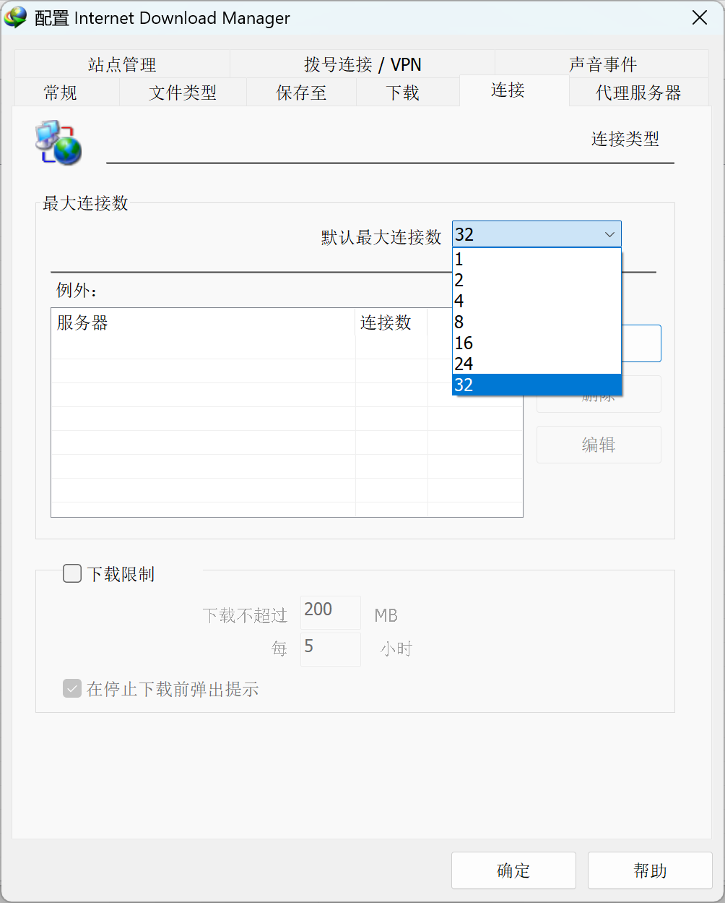

# IDM激活脚本（汉化版）

这是一个汉化版的IDM激活脚本，用于激活和重置 [Internet Download Manager](https://www.internetdownloadmanager.com/) 的试用版。本脚本参考了 [IDM-Activation-Script](https://github.com/lstprjct/IDM-Activation-Script) 的代码并进行了汉化处理。


## 特性
- **IDM冻结试用和激活**：通过注册表键锁定方法实现。
- **激活和试用持久化**：即使安装IDM更新，激活和试用状态仍然保留。
- **IDM试用重置**：可以随时重置IDM的激活和试用状态。
- **完全开源**：基于透明的批处理脚本。


## 文件格式
- 编码      `GB2312`
- 行尾      `CRLF`
- 文件名    `IDM.cmd`
- 如果下载的 `IDM.cmd` 文件无法运行，请使用 [Visual Studio Code](https://code.visualstudio.com/) 或 [Notepad++](https://notepad-plus-plus.org/) 修改文件编码和行尾


## 详细信息
- 此脚本通过注册表锁定方法激活 Internet Download Manager。
- 激活时需要联网。
- 可以直接安装IDM更新，无需再次激活。
- 激活后，如果IDM显示激活提示屏幕，只需再次运行激活选项，无需使用重置选项。

### 冻结试用
- IDM提供30天的试用期，你可以使用此选项将试用期永久锁定，无需再次重置试用，试用期也不会过期。
- 应用此选项时需要联网。
- 可以直接安装IDM更新，无需再次冻结试用期。

### 重置IDM激活/试用
- Internet Download Manager 提供30天的试用期，你可以使用此脚本来重置激活/试用期限。
- 此选项还可用于恢复IDM报告虚假序列号等类似错误的状态。


## 常见问题解答

### 激活失败怎么办？
如果激活失败或IDM显示虚假序列号提示屏幕，建议使用“冻结试用”选项。

### 遇到其他问题怎么办？
请查看 [帮助页面](https://github.com/lstprjct/IDM-Activation-Script/wiki/IAS-Help#troubleshoot) 以获取更多帮助。


## [视频教程](https://github.com/jarocheng0123/IDM-CN/blob/main/png/IDM.mp4)

<!-- 基础版：自适应宽度，带播放控件 -->
<video src="https://private-user-images.githubusercontent.com/62201503/559080911-010efa70-d281-4fc2-810d-359b13697a18.mp4?jwt=eyJ0eXAiOiJKV1QiLCJhbGciOiJIUzI1NiJ9.eyJpc3MiOiJnaXRodWIuY29tIiwiYXVkIjoicmF3LmdpdGh1YnVzZXJjb250ZW50LmNvbSIsImtleSI6ImtleTUiLCJleHAiOjE3NzI3ODIzMDMsIm5iZiI6MTc3Mjc4MjAwMywicGF0aCI6Ii82MjIwMTUwMy81NTkwODA5MTEtMDEwZWZhNzAtZDI4MS00ZmMyLTgxMGQtMzU5YjEzNjk3YTE4Lm1wND9YLUFtei1BbGdvcml0aG09QVdTNC1ITUFDLVNIQTI1NiZYLUFtei1DcmVkZW50aWFsPUFLSUFWQ09EWUxTQTUzUFFLNFpBJTJGMjAyNjAzMDYlMkZ1cy1lYXN0LTElMkZzMyUyRmF3czRfcmVxdWVzdCZYLUFtei1EYXRlPTIwMjYwMzA2VDA3MjY0M1omWC1BbXotRXhwaXJlcz0zMDAmWC1BbXotU2lnbmF0dXJlPWRjYjg4NDZkMWYzZjVlZTIxNmM1ODA2MzI4ZTJhNjFiZGYyNjhmNjc4MzFkYTUxMWVkYjllYjEzYzEzZjJmZWQmWC1BbXotU2lnbmVkSGVhZGVycz1ob3N0In0.biFp-nvxOQfXPKgZ2_ccXhfrTOfEJPY9iF2pzS1xmKU" controls="controls" style="max-width:100%;">
你的浏览器不支持video标签，请更换现代浏览器查看
</video>


## 图文教程

#### 安装 [Internet Download Manager](https://www.internetdownloadmanager.com/)



#### 以管理员身份运行(A)



#### 输入 `1`


#### 输入 `9`


#### 按 `空格键`


#### 输入 `0`


## 验证激活








## 配置 Internet Download Manager



### 文件类型



```
3GP 7Z AAC ACE AI AIF ALZ APK APP ARC ARJ ASF AVI BH BIN BR BUNDLE BZ BZ2 CDA CHM CKB CMAC CO CSV DAT DB DIF DLL DMG DOC DOCM DOCX DVR EGG EPS EXE FLAC FLV GIF GZ GZIP HDP HEIC HEIF HQX HWP IBOOKS IMG IPA ISO ISZ JAR JPE JPEG JPG JSON KEXT KEY LHA LZ LZH LZMA M3U M4A M4R M4V MDB MDF MID MKV MMF MOD MOV MP2 MP3 MP4 MPA MPE MPEG MPG MSI MSU MUI NDS NEF NRW ODB ODF ODG ODP ODS ODT OGG OGV OPUS OSX PAK PDF PAGES PKG PNG PPS PPSM PPSX PPT PPTM PPTX PSD PST PUB QT R0* R1* RA RAR RM RMVB RTF SEA SGI SIT SITX SLDM SLDX SMK SQL SWF TAR TBZ TBZ2 TGZ TIF TIFF TLZ TXT TXZ UDF VOB VSD VSDM VSDX VSS VSSM VST VSTM VSTX WAR WAV WBK WEBM WIM WKS WM WMA WMD WMS WMV WMZ WP5 WPD WPS XLS XLSB XLSM XLSX XPS XZ Z ZIP ZIPX ZPAQ ZSTD
```

### 保存至



### 最大连接数




## 免责声明

本仓库所提供的脚本、代码、文档及相关资源，**仅供学习、研究与技术交流使用**，**严禁用于商业用途、非法用途或任何侵犯他人合法权益的行为**。
使用本项目内容即表示您**自愿承担全部风险**，作者及贡献者**不对因使用本项目导致的任何直接或间接损失承担责任**。
请支持正版软件，自觉遵守相关软件的用户许可协议及国家法律法规。
